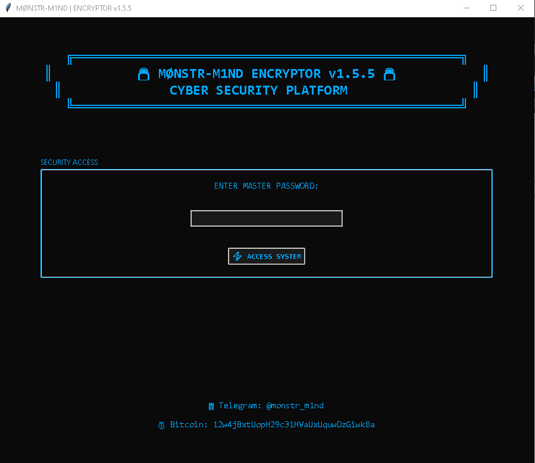
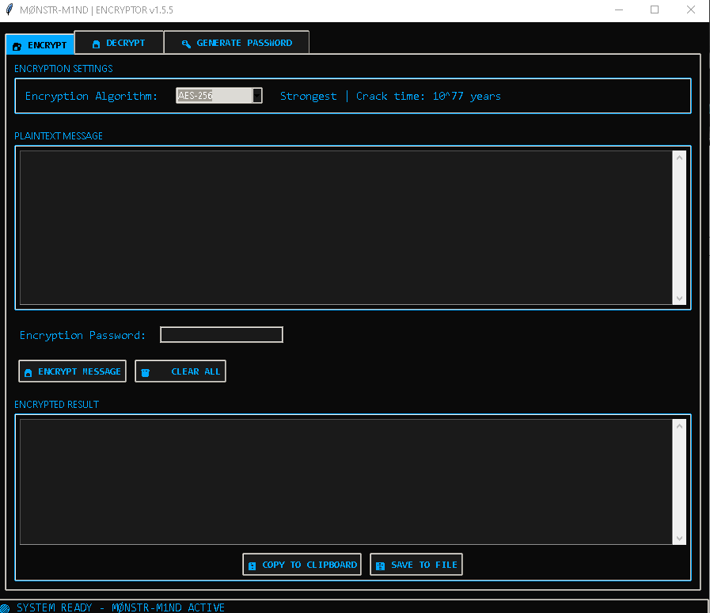
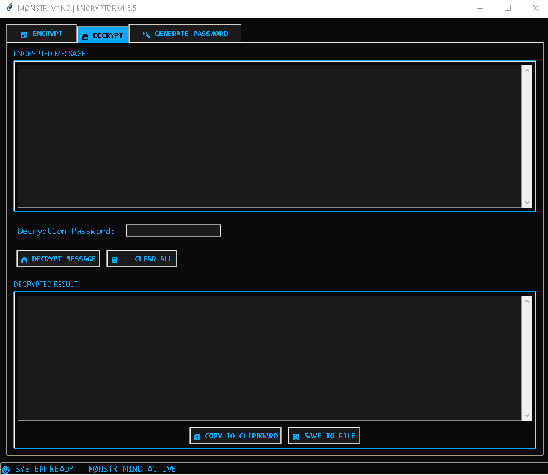

# 🔒 MØNSTR-M1ND ENCRYPTOR v1.5.5  
Advanced AES Encryption Tool with Military-Grade Security

## 📥 Download Tool  
**[Download MØNSTR-M1ND Encryptor](https://mega.nz/file/KRczHZQJ#g_kXCk8_ZL_QDWc-fRwmHJjtd4cHAVetncPkebNA4js)**

## 🚀 Features
- **AES-256/192/128 Encryption** — Military-grade encryption
- **Secure Password Generation**
- **Auto-File Deletion**
- **Cross-Platform (Win/Mac/Linux)**
- **100% Offline — No Internet Required**

## 🔐 Security Features
- AES-CFB mode encryption  
- PBKDF2 (1,000,000 iterations)  
- Random salt per encryption  
- Master password lock  
- Secure memory handling

## 📋 System Requirements
- Windows 7/8/10/11 or macOS 10.14+ or Linux  
- Python 3.8+ (bundled)  
- 50MB free disk

## 🛠️ How to Use
1) Download and extract  
2) Run `MØNSTR-M1ND.exe`  
3) Master password: `fuckyou`  
4) Choose Encrypt/Decrypt  
5) Enter message + password  
6) Done

## 📞 Contact
- **Telegram**: [@monstr_m1nd](https://t.me/monstr_m1nd)  
- **Channel**: [MCA_4HKRS](https://t.me/MCA_4HKRS)

## 💰 Donate
**Bitcoin**: `12w4jBxtUopH29c31HVaUxUquwDzGiwk8a`

## 🔒 Privacy
- No telemetry  
- No data collection  
- No external connections  
- 100% local

---

**Developed by Mr. MØNSTR-M1ND © 2025**
